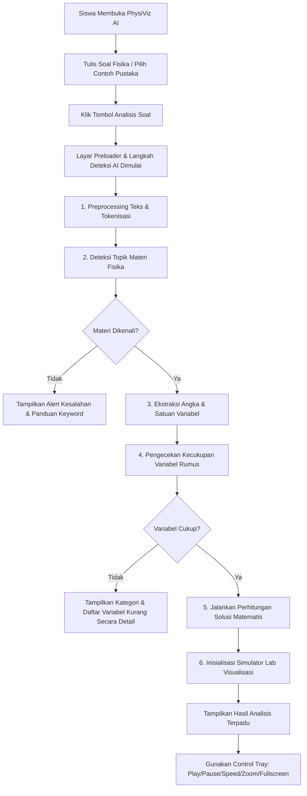

# PhysiViz AI – Platform Visualisasi & Penyelesaian Soal Fisika SMA Berbasis AI (Rule-Based Expert System)

**PhysiViz AI** adalah platform *Educational Technology (EdTech)* inovatif yang bertindak sebagai **Expert System** berbasis kecerdasan buatan aturan (*Rule-Based AI*) untuk menyelesaikan dan memvisualisasikan soal cerita Fisika Sekolah Menengah Atas (SMA) secara interaktif, akurat, dan mendalam.

Aplikasi ini mereduksi abstraksi rumus-rumus fisika yang rumit menjadi simulasi visual interaktif *real-time* yang dapat dieksplorasi secara tak terbatas oleh guru dan siswa, lengkap dengan langkah penurunan matematis secara bertahap.

---

## 🎯 Tujuan Proyek

1. **Mengurangi Hambatan Visualisasi**: Membantu siswa memahami fenomena fisika abstrak (seperti arah aliran elektron Kirchhoff, gaya Lorentz 3D, atau gaya normal lereng Newton) melalui simulasi *real-time* interaktif.
2. **Sebagai Alat Bantu Mengajar Guru**: Memberikan platform demonstrasi laboratorium virtual instan di dalam kelas tanpa memerlukan peralatan fisik yang mahal.
3. **Meningkatkan Kemampuan Problem Solving**: Memberikan penurunan rumus fisika terstruktur dengan metode pemodelan matematika Diketahui, Ditanyakan, Persamaan, Langkah, dan Kesimpulan.

---

## 🚀 Fitur Utama

- **Rule-Based AI NLP Pipeline**: Memproses input bahasa Indonesia teks bebas secara instan untuk mengekstrak data besaran angka, satuan, dan mengklasifikasikan materi fisika yang dimaksud tanpa memerlukan koneksi server (*zero-latency local computation*).
- **Laboratorium Virtual Interaktif (Interactive Concept Lab)**:
  - **GLBB**: Simulasi pergerakan mobil di jalan raya dengan grafik posisi-waktu ($s-t$) dan kecepatan-waktu ($v-t$) secara langsung.
  - **Gerak Parabola**: Simulasi peluncuran meriam proyektil dengan lintasan melengkung dan visualisasi puncak tinggi maksimum.
  - **Hukum II Newton**: Balok lereng miring interaktif dengan penayangan diagram gaya bebas (*Free-Body Diagram*) yang berubah ukurannya secara dinamis sesuai kemiringan sudut dan koefisien gesek.
  - **Hukum Pascal**: Simulasi piston mekanis hidrolik penampang kecil dan besar dengan visualisasi pergeseran level zat cair tak terkompresi.
  - **Gelombang Mekanik**: Visualisasi propagasi gelombang sinusoidal harmonik interaktif dengan kontrol amplitudo dan frekuensi manual.
  - **Hukum I Kirchhoff**: Jaringan skematik percabangan arus konduktor dengan pergerakan elektron menyala (*glowing light particles*) menggunakan akselerasi grafis SVG.
  - **Gaya Lorentz (3D Simulator)**: Ruang laboratorium 3D menggunakan pustaka **Three.js** lengkap dengan visualisasi aturan tangan kanan, arah vektor gaya magnet, kawat konduktor tembaga, dan fluks magnet homogen.
- **Dynamic Educational Panel**: Memberikan referensi definisi konsep dasar, tips trik ujian, miskonsepsi umum, serta galeri contoh soal instan untuk masing-masing materi.
- **Smart Control Tray**: Menyediakan kontrol pemutaran (Putar, Jeda, Reset), pengubah kecepatan simulasi ($0.5x$ hingga $2x$), pengatur zoom viewport, serta mode layar penuh (*fullscreen*).
- **Visual Identity Modern**: Antarmuka responsif ramah layar gawai berbasis *Light Slate/Dark Space design*, sudut membulat, efek *glassmorphism*, dan animasi transisi halaman yang elegan.

---

## 📐 Arsitektur AI (Expert System Pipeline)

AI pada PhysiViz AI bekerja di sisi klien (*client-side*) secara deterministik menggunakan pipeline pemrosesan bahasa alami aturan (*Rule-Based NLP*):

```text
+-------------------+      +-------------------------+      +--------------------------+
|  Input Teks Soal  | ---> |   Text Preprocessing    | ---> |   Topic Classification   |
| (Bahasa Indonesia)|      |  (Token, Stem, Stop)    |      | (Materi Fisika Detection)|
+-------------------+      +-------------------------+      +--------------------------+
                                                                          |
                                                                          v
+-------------------+      +-------------------------+      +--------------------------+
| Interactive Labs  | <--- |   Physics Solver Core   | <--- |   Variable Extraction    |
| & 3D Visualizer   |      | (Execute Math Formula)  |      | (Regex Numeral/Unit Parse|
+-------------------+      +-------------------------+      +--------------------------+
```

1. **Text Preprocessing**: Teks masukan pengguna dibersihkan dari tanda baca, diubah menjadi huruf kecil (*case folding*), dipisahkan menjadi token kata, serta disaring dari kata umum tak bermakna (*stopwords removal*).
2. **Topic Classification**: Memanfaatkan pencocokan kluster kata kunci (*keyword matching clusters*) berbasis aturan (*rules dictionary*) untuk memetakan soal cerita ke dalam salah satu dari 7 topik fisika utama.
3. **Variable Extraction**: Memindai token menggunakan algoritme ekspresi reguler (*Regular Expressions / Regex*) tingkat lanjut untuk mengambil nilai angka, tanda negatif/desimal, serta satuan pendukungnya (misalnya, `m/s`, `kg`, `N`, `m/s²`, `Hz`, `T`).
4. **Physics Solver Core**: Menyalurkan variabel yang diekstrak ke dalam pencari rumus. Jika data lengkap, solver menghitung langkah-demi-langkah dan jawaban akhir. Jika data tidak lengkap, solver mengembalikan status `incomplete` secara aman dan menginstruksikan pengguna tentang variabel spesifik yang hilang tanpa merusak antarmuka aplikasi (*graceful failure handling*).

---

## 🛠️ Arsitektur Web & Teknologi

- **Core Engine**: Vanilla HTML5 semantik terstruktur dan CSS3 Custom Properties modern untuk styling, didukung oleh **Tailwind CSS v4** untuk desain layout berbasis utilitas yang sangat responsif.
- **Build System**: Menggunakan **Vite** dan **TypeScript** untuk kompilasi modul ES6 yang super cepat, bebas dari dependensi berat, serta meminimalkan ukuran build akhir.
- **2D Graphics & Animation**: Pustaka manipulasi Canvas API 2D kustom yang dibundel dalam `PhysicsRenderer` dengan dukungan responsif terhadap ukuran wadah (*ResizeObserver*), akselerasi frame rate tinggi ($60\text{ fps}$ via `requestAnimationFrame`), koordinat berskala, serta pembasmian kebocoran memori (*memory leak safe*).
- **3D Graphics**: Menggunakan **Three.js** dan *OrbitControls* untuk merender skenario Gaya Lorentz interaktif dalam sudut pandang 3D sejati, lengkap dengan pencahayaan dinamis, bayangan, dan pelepasan memori *garbage collector* secara manual (*dispose*) saat berganti materi.
- **Akselerasi SVG & SMIL**: Menggunakan elemen SVG asli dikombinasikan dengan tag `<animateMotion>` untuk pergerakan elektron Kirchhoff yang mulus dan hemat CPU.

---

## 📊 Flowchart Aplikasi



---

## 📂 Struktur Folder Proyek

```text
physiviz-ai/
├── index.html            # Halaman utama (Antarmuka Responsive)
├── package.json          # Manajemen dependensi & skrip build
├── vite.config.ts        # Konfigurasi plugin Vite & Tailwind CSS v4
├── tsconfig.json         # Konfigurasi kompilasi modul TypeScript
├── README.md             # Dokumentasi teknis komprehensif (file ini)
├── .env.example          # Contoh deklarasi variabel lingkungan
├── css/
│   └── style.css         # Styling kustom layout, scrollbar, & preloader
├── js/
│   └── main.js           # Entry point utama pengendali aktivitas aplikasi
├── utils/
│   └── textProcessor.js  # Utilitas pra-pemrosesan NLP (Stopwords, Token)
├── knowledge/
│   └── knowledgeBase.js  # Basis pengetahuan deskripsi, tips, rumus dasar SMA
├── physics/
│   ├── classifier.js     # Rule engine klasifikasi materi fisika
│   ├── extractor.js      # Parser ekspresi reguler pendeteksi angka fisis
│   └── solver.js         # Pengolah perhitungan & penyusun langkah bertahap
└── visualization/
    ├── renderer.js       # Core 2D Canvas Renderer (requestAnimationFrame loop)
    ├── animationManager.js# Pengatur peralihan simulasi & tray menu interaktif
    ├── glbb.js           # Simulasi gerak lurus berubah beraturan (mobil)
    ├── projectile.js     # Simulasi gerak parabola (proyektil meriam)
    ├── newton.js         # Simulasi Hukum Newton II (balok bidang miring)
    ├── pascal.js         # Simulasi Hukum Pascal (dongkrak hidrolik)
    ├── wave.js           # Simulasi Gelombang mekanik (sinusoidal harmonis)
    ├── circuit.js        # Simulasi skematik Hukum I Kirchhoff (animasi SMIL)
    └── lorentz/          # Simulasi 3D Gaya Lorentz (Three.js WebGL)
        ├── lorentzRenderer.js # Kontroler renderer visualizer Lorentz
        ├── lorentzScene.js    # Pengelola scene, lighting, kamera, resize, & dispose
        ├── lorentzPhysics.js  # Mesin kalkulator fisika posisi muatan/medan
        ├── controls.js        # Papan kendali input menu checkbox Lorentz
        ├── rightHandModel.js  # Generator mesh 3D tangan kanan Lorentz
        ├── axisHelper.js      # Garis koordinat sumbu X, Y, Z
        └── vectorHelper.js    # Garis vektor panah dinamis F, B, I
```

---

## 📚 Daftar Materi Fisika SMA

Berikut adalah 7 modul materi fisika yang terintegrasi penuh dalam PhysiViz AI:

| Topik Materi | Persamaan Fisika Utama | Variabel yang Didukung | Output Visual Interaktif |
| :--- | :--- | :--- | :--- |
| **GLBB** | $v_t = v_0 + a \cdot t$<br>$s = v_0 \cdot t + \frac{1}{2} a \cdot t^2$ | $v_0$ (kecepatan awal), $a$ (percepatan), $t$ (waktu) | Mobil melaju di jalan, speedometer analog, grafik $s-t$ dan $v-t$. |
| **Gerak Parabola** | $y_{max} = \frac{v_0^2 \sin^2\theta}{2g}$<br>$x_{max} = \frac{v_0^2 \sin 2\theta}{g}$ | $v_0$ (kecepatan awal), $\theta$ (sudut elevasi), $g$ (gravitasi) | Lintasan titik peluru meriam, garis tinggi maksimum, papan skor metrik. |
| **Hukum II Newton** | $\Sigma F = m \cdot a$<br>$a = \frac{F - m \cdot g \sin\theta - f_{gesek}}{m}$ | $m$ (massa), $F$ (gaya tarik), $\theta$ (sudut lereng), $\mu$ (koefisien gesek) | Balok meluncur di lereng miring, visualisasi diagram gaya bebas ($N, W, f, F$) interaktif. |
| **Hukum Pascal** | $\frac{F_1}{A_1} = \frac{F_2}{A_2}$<br>$F_2 = F_1 \cdot \left(\frac{A_2}{A_1}\right)$ | $F_1$ (gaya masuk), $A_1$ (luas piston 1), $A_2$ (luas piston 2) | Sistem dongkrak hidrolik mekanis, tekanan barometer, translasi cairan. |
| **Gelombang Mekanik** | $y = A \sin(\omega t - k x)$<br>$v = \lambda \cdot f$ | $\lambda$ (panjang gelombang), $f$ (frekuensi), $A$ (amplitudo kustom) | Gelombang tali sinusoidal, penanda puncak bukit & lembah, slider kontrol. |
| **Hukum I Kirchhoff** | $\Sigma I_{masuk} = \Sigma I_{keluar}$<br>$I_{masuk} = I_1 + I_2$ | $I_{masuk}$ (arus utama), $I_1$ (arus cabang 1) | Skema rangkaian paralel, elektron bercahaya bergerak sesuai nilai arus. |
| **Gaya Lorentz** | $F_L = B \cdot I \cdot L \cdot \sin\theta$ | $B$ (medan magnet), $I$ (arus), $L$ (panjang kawat), $\theta$ (sudut kawat) | Laboratorium 3D interaktif, rotasi kamera orbital, aturan tangan kanan 3D. |

---

## 🚀 Cara Menjalankan Aplikasi Secara Lokal

Proyek ini dibangun menggunakan Vite, sehingga membutuhkan Node.js di komputer lokal Anda untuk menjalankan mode pengembangan.

### 1. Prasyarat
Pastikan Anda telah menginstal **Node.js** (rekomendasi versi 18 ke atas) dan npm di sistem Anda.

### 2. Instalasi
Kloning atau unduh kode sumber proyek ini, lalu buka terminal di folder root proyek dan jalankan perintah:
```bash
npm install
```

### 3. Jalankan Server Pengembangan
Untuk meluncurkan server lokal interaktif dengan pemuatan modul instan, ketik:
```bash
npm run dev
```
Buka browser Anda dan akses alamat yang tertera di terminal, biasanya: [http://localhost:3000](http://localhost:3000).

### 4. Build Proyek untuk Produksi
Untuk mengompilasi dan mengoptimalkan seluruh aset untuk siap di-host di server publik:
```bash
npm run build
```
Hasil kompilasi optimal akan disimpan secara otomatis di dalam direktori `/dist`.

---

## ☁️ Cara Deploy ke GitHub Pages

Situs statis modern hasil kompilasi PhysiViz AI dapat langsung di-host secara gratis menggunakan GitHub Pages.

### Metode 1: Menggunakan Action Otomatis (Rekomendasi)
1. Buat repositori baru di akun GitHub Anda (misal: `physiviz-ai`).
2. Instal paket deploy penolong melalui terminal:
   ```bash
   npm install gh-pages --save-dev
   ```
3. Tambahkan baris konfigurasi berikut di dalam berkas `package.json` Anda:
   ```json
   "homepage": "https://<nama-pengguna-github>.github.io/physiviz-ai",
   "scripts": {
     "predeploy": "npm run build",
     "deploy": "gh-pages -d dist"
   }
   ```
4. Jalankan perintah deploy di terminal:
   ```bash
   npm run deploy
   ```
   *gh-pages* akan mengompilasi aplikasi Anda dan mengunggah isi folder `/dist` langsung ke branch `gh-pages` di repositori GitHub Anda.
5. Masuk ke tab **Settings** -> **Pages** di repositori GitHub Anda, dan pastikan sumber deployment diarahkan ke branch `gh-pages` (folder root `/`).

### Metode 2: Deploy Manual via Push Folder Dist
1. Jalankan `npm run build` secara lokal untuk menghasilkan folder `/dist`.
2. Push seluruh isi folder `/dist` ke repositori atau branch khusus di GitHub Anda (misalnya branch `gh-pages`).
3. Konfigurasikan GitHub Pages di menu Settings untuk menggunakan branch tersebut sebagai sumber utama.

---

## 🗺️ Roadmap Pengembangan Selanjutnya

- [ ] **Modul Tambahan SMA**: Integrasi Hukum Hooke (Pegas), Efek Doppler Bunyi, dan Teori Kinetik Gas.
- [ ] **Export to PDF**: Menyediakan fitur cetak laporan pengerjaan langkah solusi matematis secara rapi untuk dikumpulkan kepada guru.
- [ ] **Voice Query Recognition**: Siswa dapat mendiktekan soal cerita fisika menggunakan mikrofon melalui Speech-to-Text API lokal.
- [ ] **Gamification Quest Mode**: Menyediakan tantangan kuis harian interaktif fisika untuk menguji pemahaman konsep siswa.

---

## 👥 Kontributor

- **Farel Hiayamo** (farelhiayamo@gmail.com) – *Senior EdTech Architect & Lead Developer*
- Tim Pengembang Kurikulum Fisika SMA Indonesia – *Subject Matter Experts*

---

## 📄 Lisensi

Proyek ini dilisensikan di bawah **MIT License** – bebas digunakan untuk kebutuhan edukasi, riset akademik, pembelajaran mandiri, dan kegiatan pengajaran di sekolah tanpa batasan komersial.

---
*Created with Passion for Science and Tech Education in Indonesia.* 🇮🇩⚡🔬
